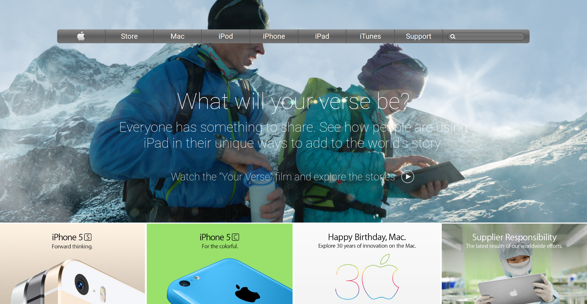

# appleClone

> 
This is a basic clone of an old apple welcome page. which I managed to clone it using pure HTML and CSS, and I named it appleClone.

## Built With

- HTML, CSS,
- Flexbox

## Live Demo

[Live Demo Link](https://raw.githack.com/elmejdki/appleClone/create-main-page/index.html)

## Getting Started

To get a local copy up and running follow these simple example steps.

### Prerequisites
To make this repository working in your local machine you need only a browser.

## Authors

👤 **Zakariae El Mejdki**

- Github: [@githubhandle](https://github.com/elmejdki)
- Twitter: [@twitterhandle](https://twitter.com/0ca7848f87ab470)
- Linkedin: [linkedin](https://www.linkedin.com/in/zakariae-el-mejdki-644898139/)

## 🤝 Contributing

Contributions, issues and feature requests are welcome!

Feel free to check the [issues page](https://github.com/elmejdki/appleClone/issues).

## Show your support

Give a ⭐️ if you like this project!

## Acknowledgments

a big hat to me and anyone who help us either by openning issues on this repository or reviewing our code :)

## 📝 License

This project is [MIT](lic.url) licensed.
